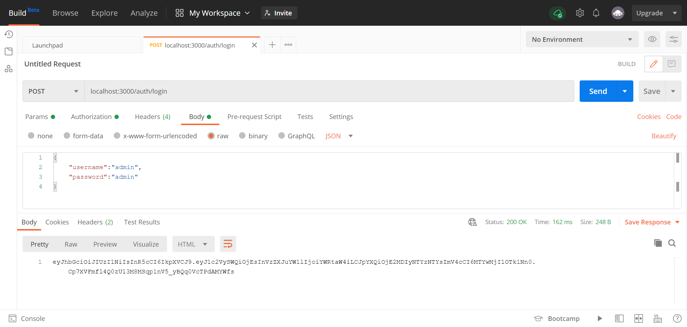
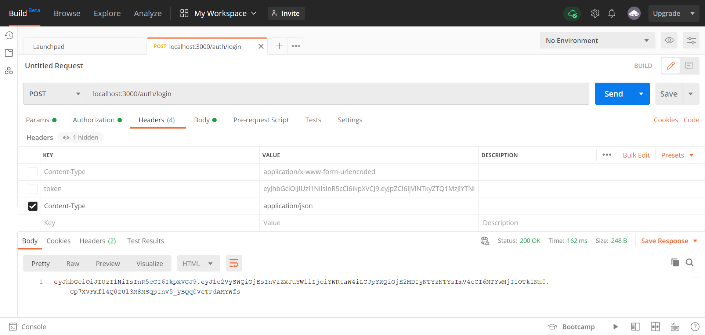
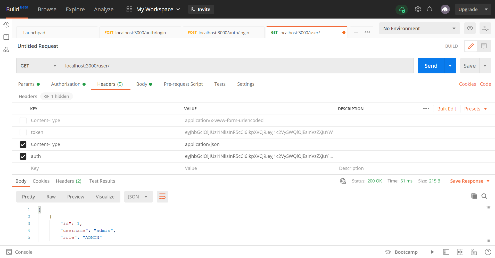

# Lab jwt e typeorm

Steps to run this project:

1. Run `npm i` command
2. Insert the first admin user `npm run migration:run` command
3. Run `npm start` command

Create a migration
```
Run `npx typeorm migration:create -n CreateAdminUser` command
```
# Para probarlo con Postman:
* Primero nos logueamos (POST localhost:3000/auth/login), obtenemos el token, 
  


* insertamos nuestro token dentro de Headers(KEY: auth: VALUE: nuestro-token), despues mandamos un get (GET localhost:3000/user/) para obtener un listado de usuarios, o para insertar un usuario nuevo (POST localhost:3000/user/


